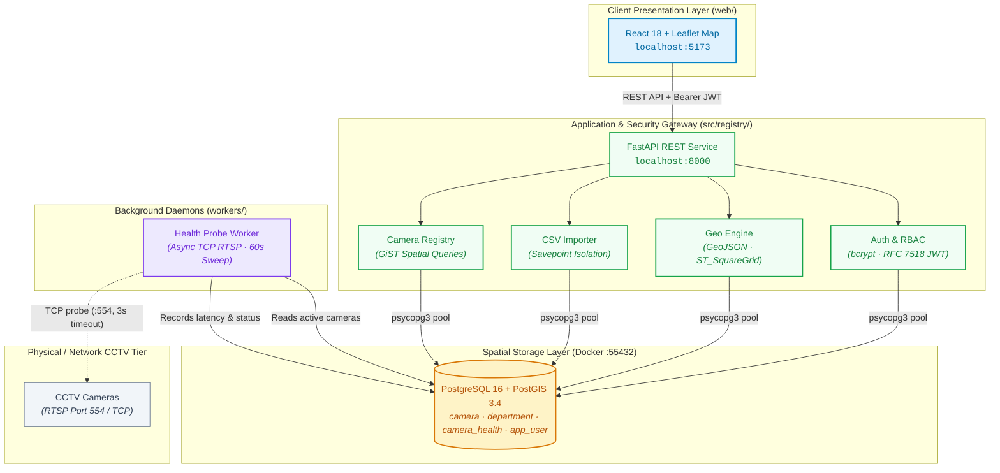

# 🛡️ Sentinel — CCTV Registry & GIS Foundation

[](https://python.org)
[](https://fastapi.tiangolo.com)
[](https://postgis.net)
[](https://react.dev)
[](https://leafletjs.com)
[](https://github.com/astral-sh/uv)
[](docker-compose.yml)
[](#testing)
[](LICENSE)

A centralised CCTV camera registry and GIS intelligence foundation featuring PostGIS spatial gap analysis, fault-tolerant CSV bulk ingestion, real-time TCP health monitoring, and role-based access control. Built for the [Gujarat Police Innovation Hackathon 2026](https://sentinel.gujarat.gov.in), where "Model 1" (a state-wide CCTV registry and GIS foundation) is a mandatory component of every submission track.

---

[Architecture](#architecture) • [Scope & Boundaries](#scope--boundaries) • [What's Built](#whats-built) • [Repository Layout](#repository-layout) • [Quickstart](#quickstart) • [API Reference](#api-reference) • [Testing](#testing) • [Roadmap](#roadmap-model-5-vision) • [License](#license)

---

## Scope & Boundaries

> [!IMPORTANT]
> **Verified Hackathon Implementation (Model 1 Scope)**
> Every feature documented in this repository is completely implemented, verified with 66 end-to-end automated tests against live PostGIS containers, and runnable locally with the [Quickstart](#quickstart) steps. It does not stream video, run computer vision models (ANPR), or execute autonomous policy decisions. Those belong to an extended, follow-on architecture. See [Roadmap (Model 5 Vision)](#roadmap-model-5-vision) for architectural specifications and rationale.

### Capability Matrix: Delivered vs. Proposed

| Capability | Model 1 (This Repository) | Model 5 (Follow-On Proposal) |
|---|:---:|:---:|
| **Central CCTV Registry** | ✅ **Delivered** (`geography(Point, 4326)`, GiST index, soft-decommission) | Inherited from Model 1 |
| **Spatial Coverage Gap Analysis** | ✅ **Delivered** (`ST_SquareGrid`, `ST_DWithin` in EPSG:3857) | Inherited from Model 1 |
| **Fault-Tolerant CSV Bulk Importer** | ✅ **Delivered** (Row-level PostgreSQL `SAVEPOINT` isolation) | Inherited from Model 1 |
| **RTSP Health Monitoring** | ✅ **Delivered** (Background TCP socket probe sweep every 60s) | Ingest & pipeline health metrics |
| **Role-Based Access Control (RBAC)** | ✅ **Delivered** (3-tier RBAC, bcrypt password hashing, RFC 7518 JWT) | Extends to fine-grained camera ACLs |
| **Web GIS Operations Console** | ✅ **Delivered** (React 18 + Leaflet interactive map, tables, & uploads) | Multi-camera video wall & alert feed |
| **Live RTSP Ingest & Decoding** | ❌ **Out of Scope** (Focused purely on registry & GIS foundation) | 📋 Planned (GStreamer / WebRTC proxy) |
| **Edge ANPR & Computer Vision** | ❌ **Out of Scope** (No GPU or inference required for registry) | 📋 Planned (TensorRT LPDNet / LPRNet) |
| **Autonomous Policy Enforcement** | ❌ **Out of Scope** (Deterministic CRUD & GIS boundaries) | 📋 Planned (Hash-chained audit ledger) |

---

## Architecture

Sentinel separates state-wide spatial asset tracking from real-time video processing. It runs as a single FastAPI service backed by PostgreSQL 16 with PostGIS, a React 18 single-page application (SPA), and a lightweight background health daemon probing camera RTSP ports on a 60-second timer.



### Component Breakdown

| Layer | Technology | Responsibilities | Ports / Network |
|---|---|---|---|
| **Web Console** | React 18, Vite 6, Leaflet 1.9 | Interactive GIS map, tabular camera filtering, metadata inspector, CSV drag-and-drop | `5173` (HTTP) |
| **API Gateway** | FastAPI, Uvicorn, Pydantic v2 | Authentication, schema validation, CRUD operations, GeoJSON feeds, gap calculations | `8000` (HTTP) |
| **Spatial Database** | PostgreSQL 16, PostGIS 3.4 | Geospatial indexing (`geography`, GiST), transactional integrity, audit records | `55432` (TCP) |
| **Health Daemon** | Python `socket`, `workers/` | Non-blocking TCP connection sweep across all active RTSP camera endpoints | Egress to `554` (TCP) |

---

## What's Built

### 📸 Centralised Camera Registry
- **Spatial Indexing**: Coordinates are stored natively as `geography(Point, 4326)` with a spatial GiST index (`src/registry/cameras.py`, `migrations/002_department_camera.sql`), enabling fast geographic lookups across state-wide datasets.
- **Audit-Safe Decommissioning**: Cameras are never permanently deleted from the database. Decommissioning updates the status flag (`status: "decommissioned"`), preserving historical sightings, telemetry, and health audit trails.
- **Pydantic Validation**: Request payloads are strictly verified against database enum constraints (`kind`: `analog` / `ip`; `storage`: `local` / `cloud` / `unknown`; `status`: `active` / `inactive` / `decommissioned`) before reaching SQL execution, preventing unhandled database exceptions.

### 📥 Fault-Tolerant CSV Bulk Importer
- **Per-Row Transaction Savepoints**: Each CSV row inserts inside its own database `SAVEPOINT` (`src/registry/importer.py`). If a row contains invalid coordinates, a non-numeric FPS value, or a duplicate `external_ref`, it is caught, recorded with its exact line number, and rolled back—allowing every other valid row in the batch to commit successfully.
- **BOM & Header Resiliency**: Automatically handles UTF-8 with BOM (`utf-8-sig`) standard from Microsoft Excel exports and strips extraneous whitespace from headers.

### 🗺️ GIS Coverage Gap Analysis
- **Dynamic PostGIS Grid**: Computes a spatial coverage grid across an arbitrary bounding box using PostGIS `ST_SquareGrid` in metric projection (EPSG:3857) paired with `ST_DWithin` (`src/registry/geo.py`).
- **Blind-Spot Discovery**: Evaluates all cells lacking an active camera within a configurable radius (default: 300m) and returns the vacant cells as GeoJSON polygons for immediate map overlay.
- **DoS Guardrail**: Runs an upfront computational cost estimation before building the spatial grid, refusing requests requiring more than 10,000 cells with an immediate 400 error to safeguard system responsiveness.

### 🩺 Non-Blocking Health Monitoring
- **Automated Sweep Daemon**: A background worker (`workers/health_probe.py`, `src/registry/health.py`) iterates through all active cameras on a 60-second interval.
- **TCP RTSP Handshake**: Tests raw socket reachability on each camera's RTSP port (default: 554) with a 3-second non-blocking timeout, measuring latency and logging failure diagnostics without the overhead of decoding video frames.
- **Telemetry Aggregation**: Aggregates network status into system-wide summaries (`reachable`, `unreachable`, `unknown`) consumed by the web console.

### 🔐 Zero-Trust Role-Based Access Control (RBAC)
- **Role Hierarchy**:
  - `viewer`: Read-only access to camera inventories, health summaries, and GIS layers.
  - `dept_admin`: Create, update, and bulk-import cameras scoped strictly to their assigned department.
  - `state_admin`: Unrestricted state-wide administrative authority across all departments.
- **Single Authority Oracle**: Every state mutation in the system is governed by a unified function, `may_write(user, department_id)` (`src/registry/auth.py`).
- **Cryptographic Security**: Passwords hashed using `bcrypt` (with explicit 72-byte safe handling); session tokens issued as HS256 JWTs signed with a minimum 32-byte secret enforced at startup per RFC 7518.

### 💻 Operational Web GIS Console
- **Interactive Map View**: Leaflet-powered viewport with color-coded CircleMarkers representing camera status (active, inactive, decommissioned, reachable, unreachable).
- **Tabular Inspection**: Fast, synchronized list view enabling operators to search, filter by department, and select cameras for deep inspection.
- **Coverage Overlay Toggle**: On-demand visual overlay of coverage gap polygons with viewport boundary detection.
- **Self-Contained Auth**: Built-in login screen with persistent JWT token storage in browser session memory (`web/src/`).

---

## Repository Layout

```
GCH-2k26/
├── docker-compose.yml              # PostgreSQL 16 + PostGIS 3.4 container (host port 55432)
├── pyproject.toml                  # Python 3.12 dependencies (FastAPI, psycopg3, pyjwt, bcrypt)
├── uv.lock                         # Pinned dependency lockfile
├── .env.example                    # Template environment variables (DATABASE_URL, JWT_SECRET)
├── migrations/                     # Ordered SQL schema migrations (applied by scripts/migrate.py)
│   ├── 001_extensions.sql          # Installs PostGIS spatial extension
│   ├── 002_department_camera.sql   # department and camera tables (geography Point + GiST index)
│   ├── 003_camera_health.sql       # camera_health telemetry table
│   └── 004_users.sql               # app_user table and user_role enum
├── scripts/
│   ├── migrate.py                  # Migration runner tracking applied state in schema_migration
│   └── init_test_db.sh             # Creates the isolated registry_test database on first boot
├── src/registry/
│   ├── config.py                   # Environment settings loader; validates minimum 32-byte secret
│   ├── db.py                       # Threaded psycopg3 connection pool
│   ├── models.py                   # Strongly-typed Camera and HealthCheck dataclasses
│   ├── cameras.py                  # Database queries for creating, reading, listing, and updating cameras
│   ├── importer.py                 # Fault-tolerant CSV bulk import with savepoint isolation
│   ├── geo.py                      # GeoJSON serialization, PostGIS ST_SquareGrid gap analysis, cost checks
│   ├── health.py                   # TCP socket probing, health history queries, summary counts
│   ├── auth.py                     # bcrypt hashing, JWT issuance/decoding, may_write() authorization
│   └── api.py                      # FastAPI REST application with 11 production endpoints
├── workers/
│   └── health_probe.py             # Periodic background daemon performing TCP sweeps on camera RTSP ports
├── tests/                          # 60 Pytest tests executing against real PostGIS with rollback isolation
└── web/                            # React 18 + Vite 6 + Leaflet single-page application
    └── src/
        ├── App.jsx                 # Main layout, authentication state, and component orchestration
        ├── api.js                  # Fetch client wrapper with automatic JWT Bearer injection
        └── components/
            ├── CameraMap.jsx       # Leaflet map with status-colored CircleMarkers
            ├── CameraTable.jsx     # Tabular camera list with row selection and status indicators
            ├── CameraDetail.jsx    # Side inspection panel with metadata and latest health diagnostics
            └── GapLayer.jsx        # GeoJSON polygon renderer displaying coverage gap zones
```

---

## Quickstart

### Prerequisites
- [Docker](https://www.docker.com) & Docker Compose
- [uv](https://github.com/astral-sh/uv) (recommended) or Python 3.12+
- [Node.js](https://nodejs.org) 18+ & npm

---

### Step 1: Clone & Configure
```bash
git clone https://github.com/yamantaka-singh/GCH-2k26.git
cd GCH-2k26
cp .env.example .env
```

### Step 2: Start PostGIS Database
```bash
docker compose up -d --wait
```

### Step 3: Install Dependencies & Run Migrations
```bash
uv sync
uv run python -m scripts.migrate
```

### Step 4: Seed Default Administrator
```bash
uv run python -c "
from src.registry.db import cursor
from src.registry.auth import create_user
with cursor() as cur:
    cur.execute(\"INSERT INTO department (code, name) VALUES ('POL', 'Police') ON CONFLICT (code) DO NOTHING\")
    cur.execute(\"SELECT id FROM department WHERE code='POL'\")
    dept_id = cur.fetchone()['id']
    create_user(cur, email='admin@gujarat.gov.in', password='sentinel', role='state_admin', department_id=dept_id)
    print(f'Seeded state_admin (admin@gujarat.gov.in) with department ID {dept_id}')
"
```

### Step 5: Start API Service & Health Worker
In Terminal 1 (API Server):
```bash
uv run uvicorn src.registry.api:app --reload --port 8000
```

In Terminal 2 (Background Health Worker):
```bash
uv run python -m workers.health_probe
```

### Step 6: Start Web Console
In Terminal 3 (Frontend):
```bash
cd web
npm install
npm run dev
```

---

### Service Endpoints & Credentials

| Service | URL | Default Credentials |
|---|---|---|
| **Web GIS Console** | [http://localhost:5173](http://localhost:5173) | `admin@gujarat.gov.in` / `sentinel` |
| **Interactive API Docs (Swagger UI)** | [http://localhost:8000/docs](http://localhost:8000/docs) | Authenticate via `/auth/login` |
| **API Documentation (ReDoc)** | [http://localhost:8000/redoc](http://localhost:8000/redoc) | Read-only OpenAPI specifications |

---

## API Reference

All routes except `/auth/login` require an `Authorization: Bearer <JWT>` header obtained via login.

| Method | Endpoint | Access Level | Description |
|:---:|---|:---:|---|
| `POST` | `/auth/login` | Public | Authenticates credentials and issues a signed HS256 JWT |
| `GET` | `/departments` | Authenticated | Lists all registered departments ordered by name |
| `GET` | `/cameras` | Authenticated | Lists cameras; supports `department_id`, `status`, `limit`, and `offset` |
| `POST` | `/cameras` | `dept_admin`, `state_admin` | Creates a camera record; validates geometry and enum types |
| `GET` | `/cameras/{id}` | Authenticated | Fetches complete metadata for a single camera |
| `PATCH` | `/cameras/{id}` | `dept_admin`, `state_admin` | Partially updates a camera; requires `lat` and `lon` to be passed together |
| `POST` | `/cameras/import` | `dept_admin`, `state_admin` | Multipart CSV upload; returns inserted row count and per-row syntax/DB errors |
| `GET` | `/cameras/{id}/health` | Authenticated | Retrieves the latest TCP probe record for a specific camera |
| `GET` | `/health/summary` | Authenticated | Returns global health counts (`reachable`, `unreachable`, `unknown`) |
| `GET` | `/geo/cameras.geojson` | Authenticated | Streams camera coordinates and properties as a GeoJSON `FeatureCollection` |
| `GET` | `/geo/gaps` | Authenticated | Calculates coverage gap polygons for a bounding box (`min_lon`, `min_lat`, `max_lon`, `max_lat`, `cell_m`, `radius_m`) |

---

## Testing

Sentinel maintains strict verification standards. All backend tests execute against a live PostgreSQL 16 + PostGIS 3.4 container using per-test transaction rollbacks, ensuring zero database pollution while testing real geometry calculations.

```bash
# Run backend test suite (60 tests against real PostGIS)
uv run pytest -v

# Run frontend test suite (6 Vitest tests)
cd web && npm test

# Verify frontend production build
cd web && npm run build
```

### Coverage Highlights
- **PostGIS Geometries**: Verifies real spherical distance calculations (`ST_DWithin`) and square grid partition mathematics (`ST_SquareGrid`) rather than mock computations.
- **Transaction Rollback & Import Isolation**: Verifies that a batch CSV with malformed rows skips only invalid lines while safely committing valid records.
- **Cryptographic RBAC**: Validates password hashing, token issuance, expired token rejection, and forgery protection across all role levels (`viewer`, `dept_admin`, `state_admin`).
- **Live Socket Probes**: Tests the health probe against real bound local TCP sockets to verify latency tracking, connection timeouts, and state updates.

---

## Roadmap (Model 5 Vision)

Sentinel is architected as the foundational "Model 1" layer (CCTV Registry & GIS) for the Gujarat Police Innovation Hackathon 2026. A comprehensive follow-on specification, [`docs/superpowers/specs/2026-09-04-sentinel-design.md`](docs/superpowers/specs/2026-09-04-sentinel-design.md), outlines the planned "Model 5" hybrid system designed to run on top of this registry:

1. **Edge ANPR & Ingest**: Low-latency RTSP ingestion and license plate recognition using TensorRT-accelerated LPDNet and LPRNet pipelines.
2. **Video Stream Forensics**: Autonomous feed-integrity verification detecting frozen frames, stream substitutions, and camera tampering without manual oversight.
3. **Policy-Bound Audit Ledger**: Cryptographically hash-chained tamper-evident audit logs enforcing granular, zone-based automated intervention rules.
4. **Offline Intelligence Tools**: Decoupled LLM-assisted tools for natural language geospatial querying, automated incident summary drafting, and CSV schema auto-mapping.

None of the Model 5 features are implemented in this codebase. They represent deliberate follow-on modules that build upon this verified Model 1 foundation. See [`docs/superpowers/plans/2026-09-04-registry-gis.md`](docs/superpowers/plans/2026-09-04-registry-gis.md) for the phased implementation sequence.

---

## License

Distributed under the Apache License 2.0. See [LICENSE](LICENSE) for full details.

Copyright 2026 Mrityunjay Singh, Yashasvi Dabas and Sentinel Contributors.
